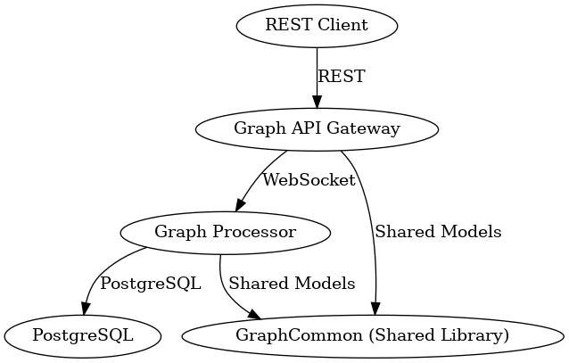

# 🌉 GraphMessageBridge

**GraphMessageBridge** is a distributed microservice system for managing and processing graph-based data.  
It is composed of three Spring Boot–based modules:

1. **Graph API Gateway** – Exposes REST endpoints to external clients and translates them into WebSocket commands.
2. **Graph Processor** – Receives structured messages over WebSocket, processes graph commands, and persists data in Neo4j graph database.
3. **Graph Common** – A shared library containing models, enums, protocol classes, and validation logic.

---

## 🧱 System Architecture



> _Figure: Client REST requests are translated to WebSocket messages, processed by the backend, and persisted._

---

## 🔌 Module Overview

### 1. 🚪 Graph API Gateway (`/GraphApiGateway`)

- Accepts REST requests from clients
- Converts them into structured WebSocket messages
- Communicates with `Graph Processor` via persistent WebSocket connection
- Handles response ACKs or error messages
- Exposes Swagger documentation for all API endpoints

### 2. ⚙️ Graph Processor (`/GraphProcessor`)

- Listens for WebSocket messages from the gateway
- Parses and validates incoming `WebSocketEnvelope` messages
- Executes graph-related commands (`CREATE`, `UPDATE`, `GET`, etc.)
- Persists nodes and relationships in Neo4j graph database
- Sends acknowledgments and data responses back to the gateway

### 3. 📦 Graph Common (`/GraphCommon`)

- Defines reusable:
  - DTOs for REST and WebSocket
  - Enums like `WebSocketMessageType` and `AckType`
  - Custom annotations (`@ValidNodesNeighbours`, etc.)
  - Parsers and validators for graph data

---

## 📁 Project Structure

```
GraphMessageBridge/
├── GraphApiGateway/      # REST → WebSocket Translator
├── GraphProcessor/       # WebSocket Receiver + DB logic
├── GraphCommon/          # Shared DTOs, Validators, Enums
└── README.md             # You are here
```

---

## 🛠️ Tech Stack

- **Java 17** + **Spring Boot**
- **WebSocket** for async internal messaging
- **Spring Web + Validation + JPA**
- **Neo4j** as the persistent store
- **Springdoc OpenAPI** for Swagger
- **Gson** for JSON serialization

---

## 🚀 How to Run

### 1. Build the shared library first:

```bash
cd GraphCommon
mvn clean install
```

### 2. Run the processor:

```bash
cd ../GraphProcessor
mvn spring-boot:run
```

### 3. Run the gateway:

```bash
cd ../GraphApiGateway
mvn spring-boot:run
```

> Ensure Neo4j is running locally or via Docker on port `7687`.

---

## 📘 Swagger API Docs

After starting the gateway, open:

```
http://localhost:8081/swagger-ui/index.html
```

---

## 🔗 Endpoints

| Service           | Type | Path                       | Description              |
| ----------------- | ---- | -------------------------- | ------------------------ |
| Graph API Gateway | REST | `/api/v1/graphs`, `/nodes` | CRUD operations on graph |
| Graph Processor   | WS   | `/ws/graph`                | Internal WebSocket API   |
| Swagger UI        | Web  | `/swagger-ui/index.html`   | API docs                 |

---

## 🧪 Testing

- REST requests should be sent to `http://localhost:8080/api/v1/...`
- The API Gateway handles WebSocket forwarding automatically
- Neo4j should be running locally or via container at port `7687`

---

## 🙌 Contributions

This project was developed as a demonstration of:

- Microservice architecture
- WebSocket-based command dispatch
- Clean separation of concerns
- Reusable, testable shared libraries

---
